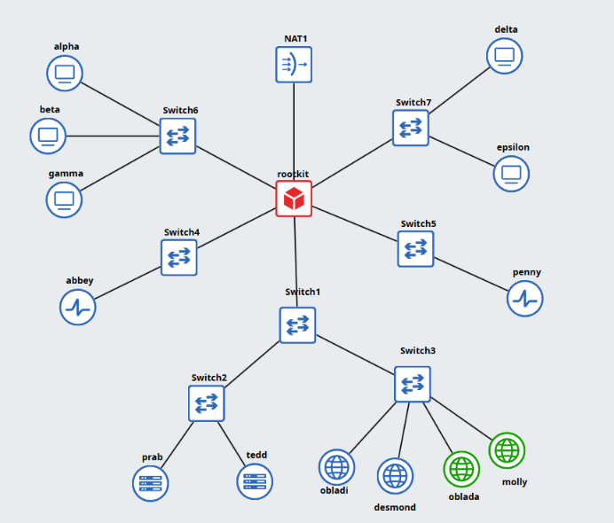

# Kelompok K-07 Laporan Resmi Jarkom Modul 1

## Anggota Kelompok

| Nama                   | NRP        |
| :--------------------- | :--------- |
| Evandra Raditya Fauzan | 5027251001 |
| Keisya Dira Anugerah   | 5027251055 |

## Daftar Isi

1. [Topologi Jaringan](#1-topologi-jaringan)
2. [Konfigurasi NAT](#2-konfigurasi-nat)
3. [Routing & DNS Resolver](#3-routing--dns-resolver)
4. [Konfigurasi DNS Authoritative](#4-konfigurasi-dns-authoritative)
5. [Konfigurasi Hostname Entitas](#5-konfigurasi-hostname-entitas)
6. [](#)
7. [](#)
8. [](#)
9. [](#)
10. [](#)
11. [Konfigurasi Reverse Proxy](#11-konfigurasi-reverse-proxy)
12. [Basic Authentication pada Path admin](#12-basic-authentication-pada-path-admin)
13. [Redirect Otomatis Menuju Nama Kanonik](#13-redirect-otomatis-menuju-nama-kanoni)
14. [Pencatatan IP Asli Client pada Access Log ](#14-pencatatan-ip-asli-client-pada-access-log)
15. [Jalur Proxy Khusus Eternal dan Orion](#15-jalur-proxy-khusus-eternal-dan-orion)
16. [](#)
17. [](#)
18. [](#)
19. [](#)
20. [](#)

## Laporan Resmi

### 1. Topologi Jaringan



Topolagi jaringan dibuat dengan router `rootkit` yang terhubung langsung ke adapter NAT, router `rootkit` juga terhubung ke switch virtual yang menghubungkan semua entitas di jaringan internal. Semua entitas memiliki IP statis yang sudah dikonfigurasi sebelumnya.

#### Switch 1
- Network: 10.67.1.0/24
- Netmask: 255.255.255.0
- Gateway: 10.67.1.1

#### Switch 2
Switch 2 dan Switch 3 hanya meneruskan paket dari Switch 1 sehingga sama-sama memiliki konfigurasi jaringan yang sama dengan Switch 1.

##### Prab
- IP: 10.67.1.2
- Netmask: 255.255.255.0
- Gateway: 10.67.1.1

##### Tedd
- IP: 10.67.1.3
- Netmask: 255.255.255.0
- Gateway: 10.67.1.1

#### Switch 3
Switch 2 dan Switch 3 hanya meneruskan paket dari Switch 1 sehingga sama-sama memiliki konfigurasi jaringan yang sama dengan Switch 1.

##### Obladi
- IP: 10.67.1.4
- Netmask: 255.255.255.0
- Gateway: 10.67.1.1

##### Desmond
- IP: 10.67.1.5
- Netmask: 255.255.255.0
- Gateway: 10.67.1.1

##### Oblada
- IP: 10.67.1.6
- Netmask: 255.255.255.0
- Gateway: 10.67.1.1

##### Molly
- IP: 10.67.1.7
- Netmask: 255.255.255.0
- Gateway: 10.67.1.1

#### Switch 4

##### Abbey
- IP: 10.67.4.2
- Netmask: 255.255.255.0
- Gateway: 10.67.4.1

#### Switch 5

##### Penny
- IP: 10.67.5.2
- Netmask: 255.255.255.0
- Gateway: 10.67.5.1

#### Switch 6

##### Alpha
- IP: 10.67.6.2
- Netmask: 255.255.255.0
- Gateway: 10.67.6.1

##### Beta
- IP: 10.67.6.3
- Netmask: 255.255.255.0
- Gateway: 10.67.6.1

##### Gamma
- IP: 10.67.6.4
- Netmask: 255.255.255.0
- Gateway: 10.67.6.1

#### Switch 7

##### Delta
- IP: 10.67.7.2
- Netmask: 255.255.255.0
- Gateway: 10.67.7.1

##### Epsilon
- IP: 10.67.7.3
- Netmask: 255.255.255.0
- Gateway: 10.67.7.1

### 2. Konfigurasi NAT
Untuk konfigurasi NAT, router `rootkit` menggunakan iptables untuk melakukan NAT pada jaringan internal dan disimpan di `init.sh` agar konfigurasi NAT tetap aktif setelah reboot. Berikut adalah konfigurasi NAT yang digunakan:

```bash
bakekok

```