# Kelompok K-07 Laporan Resmi Jarkom Modul 2

## Anggota Kelompok

| Nama                   | NRP        |
| :--------------------- | :--------- |
| Evandra Raditya Fauzan | 5027251001 |
| Keisya Dira Anugerah   | 5027251055 |

## Daftar Isi

1. [Topologi Jaringan](#1-topologi-jaringan)
2. [Konfigurasi NAT](#2-konfigurasi-nat)
3. [Routing dan DNS Resolver](#3-routing-dan-dns-resolver)
4. [Konfigurasi DNS Authoritative](#4-konfigurasi-dns-authoritative)
5. [Konfigurasi Hostname Entitas](#5-konfigurasi-hostname-entitas)
6. [Sinkronisasi Zone Transfer DNS](#6-sinkronisasi-zone-transfer-dns)
7. [Konfigurasi A Record dan CNAME Record](#7-konfigurasi-a-record-dan-cname-record)
8. [Konfigurasi Reverse DNS (PTR Record)](#8-konfigurasi-reverse-dns-ptr-record)
9. [Web Server Statis Apache dan Autoindex (Area Vault)](#9-web-server-statis-apache-dan-autoindex-area-vault)
10. [Web Server Dinamis Nginx dan PHP-FPM dengan Clean URL (Area Core)](#10-web-server-dinamis-nginx-dan-php-fpm-dengan-clean-url-area-core)
11. [Konfigurasi Reverse Proxy](#11-konfigurasi-reverse-proxy)
12. [Basic Authentication pada Path admin](#12-basic-authentication-pada-path-admin)
13. [Redirect Otomatis Menuju Nama Kanonik](#13-redirect-otomatis-menuju-nama-kanonik)
14. [Pencatatan IP Asli Client pada Access Log](#14-pencatatan-ip-asli-client-pada-access-log)
15. [Jalur Proxy Khusus Eternal dan Orion](#15-jalur-proxy-khusus-eternal-dan-orion)
16. [Pengujian Beban (Stress Test) dengan ApacheBench](#16-pengujian-beban-stress-test-dengan-apachebench)
17. [Penambahan TXT Record Klien DNS](#17-penambahan-txt-record-klien-dns)
18. [Simulasi Perubahan IP Fiktif dan DNS Cache TTL](#18-simulasi-perubahan-ip-fiktif-dan-dns-cache-ttl)
19. [Binding CNAME Outbound ke Domain Eksternal](#19-binding-cname-outbound-ke-domain-eksternal)
20. [Pengaturan Autostart Service dan Normalisasi Konfigurasi](#20-pengaturan-autostart-service-dan-normalisasi-konfigurasi)

---

## Laporan Resmi

### 1. Topologi Jaringan


Topologi jaringan dibuat dengan router `rootkit` yang terhubung langsung ke adapter NAT, router `rootkit` juga terhubung ke switch virtual yang menghubungkan semua entitas di jaringan internal. Semua entitas memiliki IP statis yang sudah dikonfigurasi sebelumnya.

#### Switch 1
- Network: 10.67.1.0/24
- Netmask: 255.255.255.0
- Gateway: 10.67.1.1

#### Switch 2
Switch 2 dan Switch 3 hanya meneruskan paket dari Switch 1 sehingga sama-sama memiliki konfigurasi jaringan yang sama dengan Switch 1.

##### Prab
- IP: 10.67.1.2
- Netmask: 255.255.255.0
- Gateway: 10.67.1.1

##### Tedd
- IP: 10.67.1.3
- Netmask: 255.255.255.0
- Gateway: 10.67.1.1

#### Switch 3
Switch 2 dan Switch 3 hanya meneruskan paket dari Switch 1 sehingga sama-sama memiliki konfigurasi jaringan yang sama dengan Switch 1.

##### Obladi
- IP: 10.67.1.4
- Netmask: 255.255.255.0
- Gateway: 10.67.1.1

##### Desmond
- IP: 10.67.1.5
- Netmask: 255.255.255.0
- Gateway: 10.67.1.1

##### Oblada
- IP: 10.67.1.6
- Netmask: 255.255.255.0
- Gateway: 10.67.1.1

##### Molly
- IP: 10.67.1.7
- Netmask: 255.255.255.0
- Gateway: 10.67.1.1

#### Switch 4

##### Abbey
- IP: 10.67.4.2
- Netmask: 255.255.255.0
- Gateway: 10.67.4.1

#### Switch 5

##### Penny
- IP: 10.67.5.2
- Netmask: 255.255.255.0
- Gateway: 10.67.5.1

#### Switch 6

##### Alpha
- IP: 10.67.6.2
- Netmask: 255.255.255.0
- Gateway: 10.67.6.1

##### Beta
- IP: 10.67.6.3
- Netmask: 255.255.255.0
- Gateway: 10.67.6.1

##### Gamma
- IP: 10.67.6.4
- Netmask: 255.255.255.0
- Gateway: 10.67.6.1

#### Switch 7

##### Delta
- IP: 10.67.7.2
- Netmask: 255.255.255.0
- Gateway: 10.67.7.1

##### Epsilon
- IP: 10.67.7.3
- Netmask: 255.255.255.0
- Gateway: 10.67.7.1

---

### 2. Konfigurasi NAT
Untuk konfigurasi NAT, router `rootkit` menggunakan iptables untuk melakukan NAT pada jaringan internal dan disimpan di `init.sh` agar konfigurasi NAT tetap aktif setelah reboot. Berikut adalah konfigurasi NAT yang digunakan:

```bash
bakekok
```

---

### 3. Routing dan DNS Resolver
*(Dikerjakan oleh Keisya Dira Anugerah)*

---

### 4. Konfigurasi DNS Authoritative
*(Dikerjakan oleh Keisya Dira Anugerah)*

---

### 5. Konfigurasi Hostname Entitas
*(Dikerjakan oleh Keisya Dira Anugerah)*

---

### 6. Sinkronisasi Zone Transfer DNS

#### Soal
Pastikan zone transfer berjalan, pastikan `tedd` telah menerima salinan zona terbaru dari `prab`. Nilai serial SOA di keduanya harus sama karena keduanya tidak bisa dipisahkan dan saling melengkapi.

#### Penjelasan & Konfigurasi
Pada sistem DNS master-slave:
- **Master (`prab` - `10.67.1.2`)**: Mengelola file database utama domain `k07.com`. Master dikonfigurasikan agar mengizinkan pengiriman zona (zone transfer via protokol AXFR) ke node slave dengan perintah `allow-transfer { 10.67.1.3; };` dan mengirimkan sinyal pembaruan otomatis dengan `notify yes; also-notify { 10.67.1.3; };`.
- **Slave (`tedd` - `10.67.1.3`)**: Dikonfigurasikan dengan `type slave;` yang secara berkala atau ketika mendapat notifikasi akan menduplikasi file zona dari master `prab`.
- **Serial SOA**: Merupakan nomor versi file zona. Jika terjadi perubahan di master, serial dinaikkan dan slave akan memperbarui datanya sampai serial keduanya bernilai sama.

Untuk menguji dan memvalidasi apakah zone transfer berjalan mulus serta serial SOA identik, digunakan script pengujian otomatis [`scripts/soal-6/verify_zone_transfer.sh`](scripts/soal-6/verify_zone_transfer.sh):

```bash
#!/bin/bash

# Konfigurasi domain dan IP server
DOMAIN="k07.com"
IP_PRAB="10.67.1.2"
IP_TEDD="10.67.1.3"

echo "=== 1. Test Query AXFR dari tedd ke prab ==="
dig axfr @$IP_PRAB $DOMAIN +short

echo -e "\n=== 2. Pengecekan Serial SOA ==="
SERIAL_PRAB=$(dig +short SOA @$IP_PRAB $DOMAIN | awk '{print $3}')
SERIAL_TEDD=$(dig +short SOA @$IP_TEDD $DOMAIN | awk '{print $3}')

echo "Serial di prab (Master): $SERIAL_PRAB"
echo "Serial di tedd (Slave) : $SERIAL_TEDD"

if [ -n "$SERIAL_PRAB" ] && [ "$SERIAL_PRAB" == "$SERIAL_TEDD" ]; then
    echo -e "\n[STATUS] BERHASIL: Nilai serial SOA identik ($SERIAL_PRAB). Zone transfer tersinkronisasi."
else
    echo -e "\n[STATUS] GAGAL: Nilai serial berbeda atau salah satu server tidak merespons query SOA."
fi
```

#### Cara Pengujian & Hasil
Script dijalankan pada node slave `tedd`. Script melakukan dua tahapan validasi:
1. Meminta transfer zona lengkap (AXFR) ke master `prab` untuk memastikan port 53 TCP terbuka dan izin `allow-transfer` aktif.
2. Mengambil angka serial ketiga dari record SOA di `prab` dan `tedd`. Apabila nilainya sama persis, output menyatakan bahwa sinkronisasi zone transfer telah berhasil 100%.

---

### 7. Konfigurasi A Record dan CNAME Record

#### Soal
`abbey` dan `penny` sebagai gerbang utama, `obladi` dan `desmond` sebagai web statis, `oblada` dan `molly` sebagai web dinamis. Tambahkan pada zona `k07.com`:
- A record untuk `vault.k07.com` (IP `obladi` & `desmond`).
- A record untuk `core.k07.com` (IP `oblada` & `molly`).
- CNAME record: `www.k07.com` → `penny.k07.com.`.
- CNAME record: `static.k07.com` → `abbey.k07.com.`.

Verifikasi dari klien bahwa seluruh hostname tersebut ter-resolve ke tujuan yang benar dan konsisten.

#### Penjelasan & Konfigurasi
Pada arsitektur jaringan ini:
1. `vault.k07.com` menggunakan konsep **DNS Round-Robin** dengan memasukkan dua A record sekaligus (`10.67.1.4` dan `10.67.1.5`). Hal ini memungkinkan pembagian beban akses antara server arsip statis `obladi` dan `desmond`.
2. `core.k07.com` juga menerapkan **DNS Round-Robin** dengan dua A record (`10.67.1.6` dan `10.67.1.7`) untuk membagi beban aplikasi web dinamis `oblada` dan `molly`.
3. CNAME record `www.k07.com` mengarahkan alias web publik utama ke FQDN gerbang `penny.k07.com.`.
4. CNAME record `static.k07.com` mengarahkan alias web statis ke FQDN gerbang `abbey.k07.com.`.

Konfigurasi ditambahkan ke file database zona master `/etc/bind/db.k07.com` di node `prab` menggunakan script [`scripts/soal-7/7.sh`](scripts/soal-7/7.sh) atau file template [`scripts/soal-7/1.conf`](scripts/soal-7/1.conf):

```bash
cat >> /etc/bind/db.k07.com << 'ZONE'
; 1. Round-Robin A Record untuk vault (IP obladi & desmond)
vault   IN      A       10.67.1.4         ; IP obladi
vault   IN      A       10.67.1.5         ; IP desmond

; 2. Round-Robin A Record untuk core (IP oblada & molly)
core    IN      A       10.67.1.6         ; IP oblada
core    IN      A       10.67.1.7         ; IP molly

; 3. CNAME Record
; Catatan: Beri tanda titik (.) di akhir FQDN tujuan CNAME
www     IN      CNAME   penny.k07.com.
static  IN      CNAME   abbey.k07.com.
ZONE
```

Setelah menambahkan konfigurasi, reload layanan BIND dengan perintah:
```bash
named-checkzone k07.com /etc/bind/db.k07.com
rndc reload
```

#### Hasil Pengujian & Bukti

1. **Resolusi DNS `vault.k07.com`**
   
   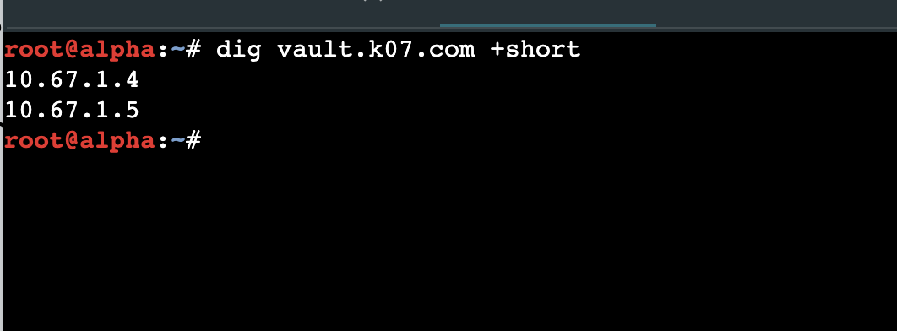
   
   Perintah `dig vault.k07.com +short` diuji dari client `alpha`. Output mengembalikan dua IP sekaligus yaitu `10.67.1.4` (`obladi`) dan `10.67.1.5` (`desmond`), membuktikan mekanisme Round-Robin berjalan baik.

2. **Resolusi DNS `core.k07.com`**
   
   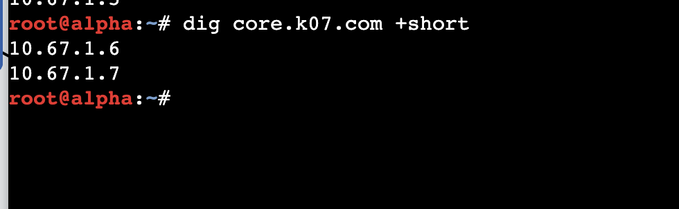
   
   Perintah `dig core.k07.com +short` diuji dari client `alpha`. Output mengembalikan dua IP yaitu `10.67.1.6` (`oblada`) dan `10.67.1.7` (`molly`).

3. **Resolusi CNAME `www.k07.com`**
   
   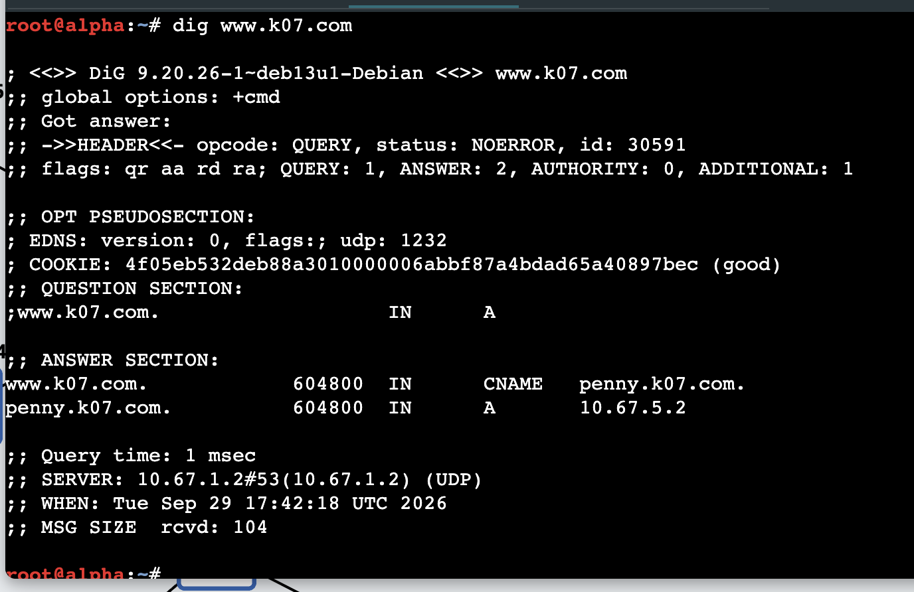
   
   Perintah `dig www.k07.com` menampilkan bahwa `www.k07.com` adalah CNAME yang mengarah ke `penny.k07.com.`, dan resolver langsung melanjutkan resolusi ke alamat IP Penny `10.67.5.2`.

4. **Resolusi CNAME `static.k07.com`**
   
   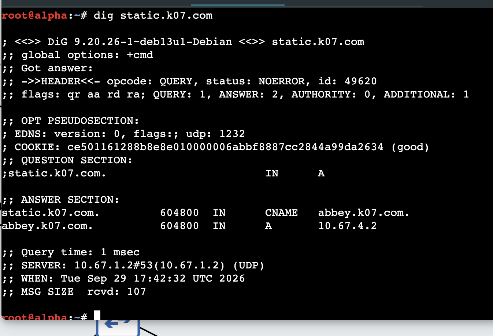
   
   Perintah `dig static.k07.com` menampilkan bahwa `static.k07.com` adalah CNAME yang mengarah ke `abbey.k07.com.`, dan berhasil di-resolve ke alamat IP Abbey `10.67.4.2`.

---

### 8. Konfigurasi Reverse DNS (PTR Record)

#### Soal
Di `prab` (master) deklarasikan reverse zone untuk segmen jaringan tempat `abbey`, `penny`, area vault, dan area core berada. Di `tedd` (slave) tarik reverse zone tersebut sebagai slave, isi PTR untuk keempat hostname itu agar pencarian balik IP address mengembalikan hostname yang benar, lalu pastikan query reverse untuk alamat `abbey`, `penny`, area vault, dan area core dijawab secara authoritative.

#### Penjelasan & Konfigurasi
Reverse DNS berfungsi untuk memetakan alamat IP kembali ke nama domain (pointer / PTR record). Segmen IP yang terlibat meliputi:
- Subnet `10.67.1.0/24` (area vault `obladi`, `desmond` dan area core `oblada`, `molly`) → Zone: `1.67.10.in-addr.arpa`.
- Subnet `10.67.4.0/24` (`abbey` di IP `10.67.4.2`) → Zone: `4.67.10.in-addr.arpa`.
- Subnet `10.67.5.0/24` (`penny` di IP `10.67.5.2`) → Zone: `5.67.10.in-addr.arpa`.

Langkah-langkah konfigurasi:

1. **Deklarasi Zona Reverse di Master `prab` ([`scripts/soal-8/8-2.sh`](scripts/soal-8/8-2.sh))**  
   Menambahkan deklarasi zona pada `/etc/bind/named.conf.local` di `prab`:

   ```named
   zone "1.67.10.in-addr.arpa" {
       type master;
       file "/etc/bind/db.10.67.1";
       notify yes;
       also-notify { 10.67.1.3; };
       allow-transfer { 10.67.1.3; };
   };

   zone "4.67.10.in-addr.arpa" {
       type master;
       file "/etc/bind/db.10.67.4";
       notify yes;
       also-notify { 10.67.1.3; };
       allow-transfer { 10.67.1.3; };
   };

   zone "5.67.10.in-addr.arpa" {
       type master;
       file "/etc/bind/db.10.67.5";
       notify yes;
       also-notify { 10.67.1.3; };
       allow-transfer { 10.67.1.3; };
   };
   ```

2. **Pengisian File Database PTR ([`scripts/soal-8/8-3.sh`](scripts/soal-8/8-3.sh))**  
   Membuat file database reverse record di `prab`:

   - File `/etc/bind/db.10.67.1`:
     ```bind
     $TTL 604800
     @   IN  SOA prab.k07.com. admin.k07.com. ( 1 604800 86400 2419200 604800 )
     @   IN  NS  prab.k07.com.
     @   IN  NS  tedd.k07.com.

     4   IN  PTR obladi.k07.com.
     5   IN  PTR desmond.k07.com.
     6   IN  PTR oblada.k07.com.
     7   IN  PTR molly.k07.com.
     ```

   - File `/etc/bind/db.10.67.4`:
     ```bind
     $TTL 604800
     @   IN  SOA prab.k07.com. admin.k07.com. ( 1 604800 86400 2419200 604800 )
     @   IN  NS  prab.k07.com.
     @   IN  NS  tedd.k07.com.

     2   IN  PTR abbey.k07.com.
     ```

   - File `/etc/bind/db.10.67.5`:
     ```bind
     $TTL 604800
     @   IN  SOA prab.k07.com. admin.k07.com. ( 1 604800 86400 2419200 604800 )
     @   IN  NS  prab.k07.com.
     @   IN  NS  tedd.k07.com.

     2   IN  PTR penny.k07.com.
     ```

3. **Sinkronisasi ke Slave `tedd`**  
   Di `tedd`, ketiga zona dideklarasikan sebagai `type slave;` dengan master `10.67.1.2;`.

#### Hasil Pengujian & Bukti

Pengujian dilakukan menggunakan perintah `dig -x <IP>` untuk memastikan status jawaban bersifat authoritative (`flags: qr aa rd ra`, ditandai dengan flag `aa` = Authoritative Answer):

1. **Reverse Query IP Abbey (`10.67.4.2`)**
   
   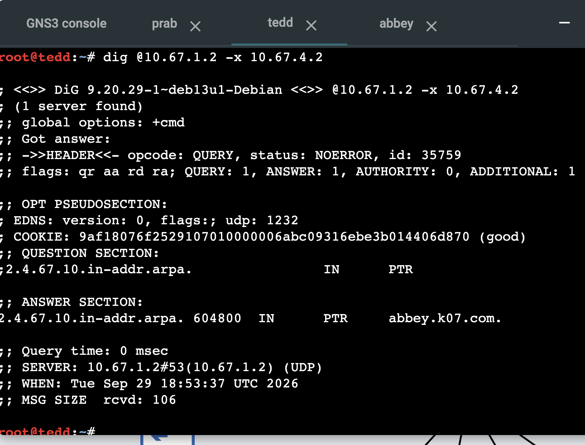
   
   Perintah `dig @10.67.1.2 -x 10.67.4.2` mengembalikan PTR `abbey.k07.com.` dengan flag `aa` aktif.

2. **Reverse Query IP Penny (`10.67.5.2`) pada Slave Tedd**
   
   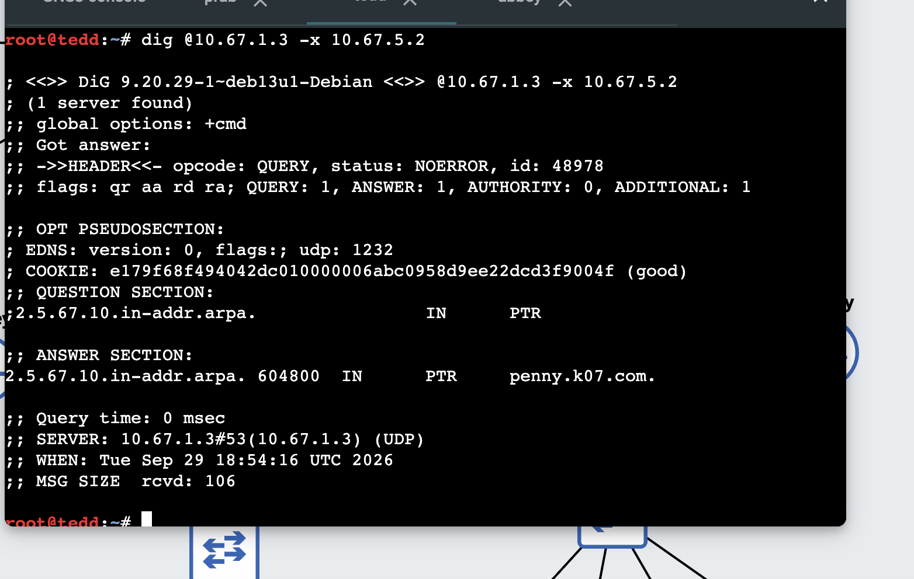
   
   Perintah `dig @10.67.1.3 -x 10.67.5.2` langsung diarahkan ke server slave `tedd`. Hasilnya mengembalikan `penny.k07.com.` secara authoritative (`aa`), membuktikan slave berhasil menarik zona reverse.

3. **Reverse Query IP Oblada (`10.67.1.6`) pada Slave Tedd**
   
   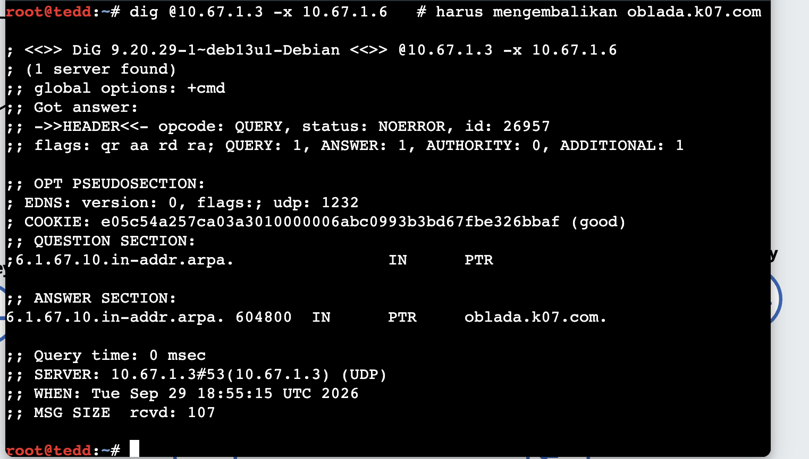
   
   Perintah `dig @10.67.1.3 -x 10.67.1.6` pada slave `tedd` mengembalikan PTR `oblada.k07.com.` secara authoritative.

4. **Reverse Query IP Molly (`10.67.1.7`) pada Slave Tedd**
   
   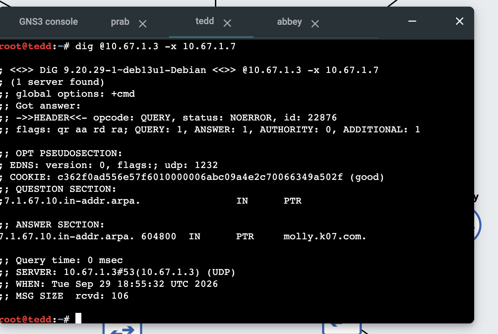
   
   Perintah `dig @10.67.1.3 -x 10.67.1.7` pada slave `tedd` mengembalikan PTR `molly.k07.com.` secara authoritative.

---

### 9. Web Server Statis Apache dan Autoindex (Area Vault)

#### Soal
Jalankan layanan web statis pada hostname di node area vault (menggunakan apache). Buka folder direktori `/arsip/` dan aktifkan fitur `autoindex` (directory listing) pada konfigurasi Apache sehingga seluruh daftar file di dalamnya dapat ditelusuri langsung dari browser. Akses pengujian harus dilakukan melalui hostname, bukan IP address.

#### Penjelasan & Konfigurasi
Area vault beranggotakan dua node penyimpan data statis: `obladi` dan `desmond`. Kedua server ini dikonfigurasikan dengan Apache2:
1. Membuat direktori `/var/www/html/arsip/` dan mengisinya dengan berkas contoh.
2. Di dalam VirtualHost `/etc/apache2/sites-available/000-default.conf`, direktori `/var/www/html/arsip` diberikan direktif `Options +Indexes`. Opsi ini memberitahu Apache agar mengaktifkan directory listing otomatis jika file index default (`index.html`) tidak ditemukan di folder tersebut.
3. Modul autoindex diaktifkan dengan `a2enmod autoindex`.

Script konfigurasi pada node `obladi` ([`scripts/soal-9/obladi.sh`](scripts/soal-9/obladi.sh)):
```bash
apt-get update
apt-get install -y apache2

mkdir -p /var/www/html/arsip
echo "Ini arsip rahasia obladi" > /var/www/html/arsip/dokumen1.txt
echo "Catatan log obladi" > /var/www/html/arsip/catatan.txt

cat << 'EOF' > /etc/apache2/sites-available/000-default.conf
<VirtualHost *:80>
    ServerAdmin webmaster@k07.com
    ServerName obladi.k07.com
    ServerAlias vault.k07.com
    DocumentRoot /var/www/html

    # Aktifkan fitur autoindex khusus pada path /arsip
    <Directory /var/www/html/arsip>
        Options +Indexes
        AllowOverride None
        Require all granted
    </Directory>

    ErrorLog ${APACHE_LOG_DIR}/error.log
    CustomLog ${APACHE_LOG_DIR}/access.log combined
</VirtualHost>
EOF

a2enmod autoindex
service apache2 restart
```

Script konfigurasi pada node `desmond` ([`scripts/soal-9/desmond.sh`](scripts/soal-9/desmond.sh)):
```bash
apt-get update
apt-get install -y apache2

mkdir -p /var/www/html/arsip
echo "Ini arsip rahasia desmond" > /var/www/html/arsip/file_desmond.txt
echo "Data cadangan desmond" > /var/www/html/arsip/backup.txt

cat << 'EOF' > /etc/apache2/sites-available/000-default.conf
<VirtualHost *:80>
    ServerAdmin webmaster@k07.com
    ServerName desmond.k07.com
    ServerAlias vault.k07.com
    DocumentRoot /var/www/html

    # Aktifkan fitur autoindex khusus pada path /arsip
    <Directory /var/www/html/arsip>
        Options +Indexes
        AllowOverride None
        Require all granted
    </Directory>

    ErrorLog ${APACHE_LOG_DIR}/error.log
    CustomLog ${APACHE_LOG_DIR}/access.log combined
</VirtualHost>
EOF

a2enmod autoindex
service apache2 restart
```

#### Hasil Pengujian & Bukti

Pengujian dilakukan melalui hostname menggunakan curl:

1. **Akses Autoindex ke `http://obladi.k07.com/arsip/` ([`scripts/soal-9/testing-1.sh`](scripts/soal-9/testing-1.sh))**
   
   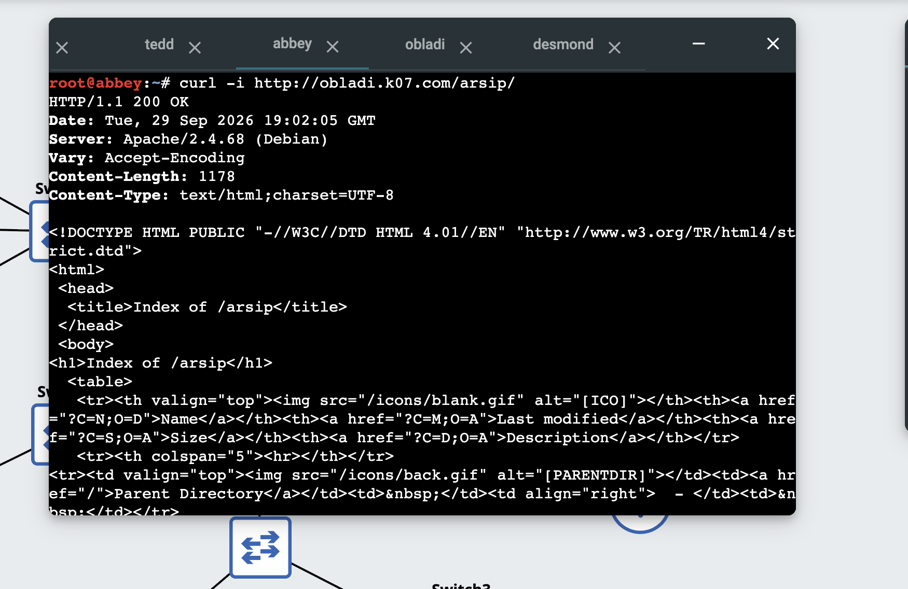
   
   Hasil curl menunjukkan respon `HTTP/1.1 200 OK` dengan dokumen HTML berlabel `Index of /arsip` yang menampilkan berkas `dokumen1.txt` dan `catatan.txt`.

2. **Akses Autoindex ke `http://desmond.k07.com/arsip/` ([`scripts/soal-9/testing-2.sh`](scripts/soal-9/testing-2.sh))**
   
   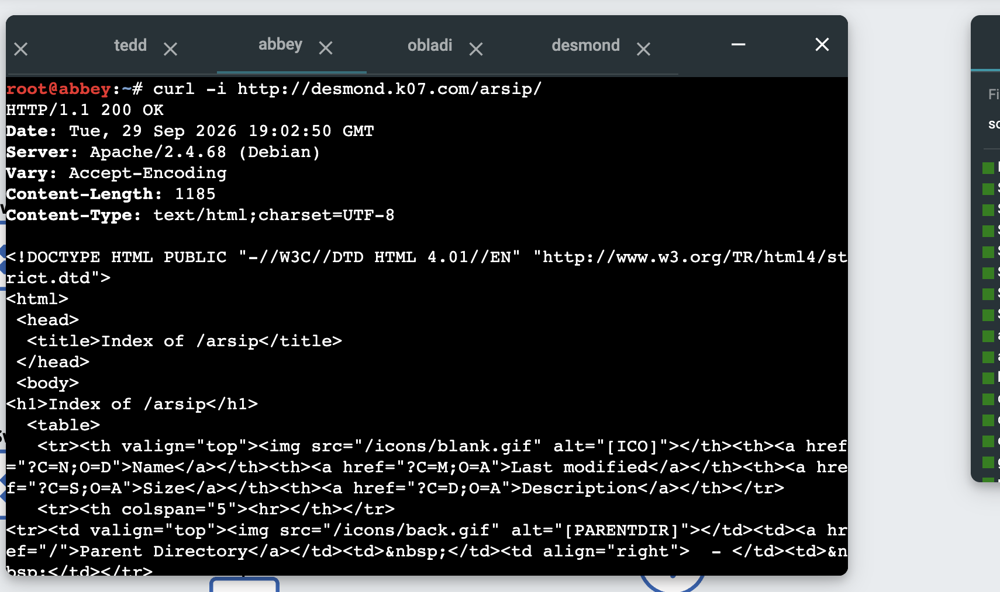
   
   Hasil curl menunjukkan respon `HTTP/1.1 200 OK` dengan direktori listing Apache `Index of /arsip` yang memuat berkas `backup.txt` dan `file_desmond.txt`.

---

### 10. Web Server Dinamis Nginx dan PHP-FPM dengan Clean URL (Area Core)

#### Soal
Jalankan layanan web dinamis (PHP-FPM) pada hostname di node core (menggunakan nginx). Buat sebuah aplikasi sederhana yang memuat halaman beranda dan halaman profil. Terapkan aturan rewrite pada server sehingga akses ke `/profil` dapat berfungsi dengan URL bersih (tanpa akhiran `.php`). Akses pengujian wajib dilakukan melalui hostname.

#### Penjelasan & Konfigurasi
Area core beranggotakan dua node web server dinamis: `oblada` dan `molly`. Keduanya menggunakan **Nginx** sebagai web server dan **PHP-FPM** sebagai FastCGI handler untuk mengeksekusi skrip PHP.

Fitur **Clean URL** diterapkan menggunakan direktif `try_files` di Nginx:
- Ketika pengguna membuka endpoint `/profil`, Nginx memproses aturan `location = /profil { try_files /profil.php =404; ... }`.
- Permintaan otomatis diarahkan secara internal ke skrip `/profil.php` dan dikirimkan ke soket FastCGI PHP-FPM tanpa perlu menampilkan ekstensi `.php` di URL browser.

Script konfigurasi pada node `oblada` ([`scripts/soal-10/oblada.sh`](scripts/soal-10/oblada.sh)):
```bash
apt-get update
apt-get install -y nginx php-fpm

PHP_SOCK=$(ls /run/php/php*-fpm.sock | head -n 1)

mkdir -p /var/www/html

# Halaman Beranda
cat << 'EOF' > /var/www/html/index.php
<?php
echo "<h1>Selamat Datang di Beranda - OBLADA</h1>";
echo "<p>Host: " . gethostname() . "</p>";
?>
EOF

# Halaman Profil
cat << 'EOF' > /var/www/html/profil.php
<?php
echo "<h1>Halaman Profil - OBLADA</h1>";
echo "<p>Identitas: Node Dinamis Oblada (Area Core)</p>";
?>
EOF

cat << EOF > /etc/nginx/sites-available/default
server {
    listen 80 default_server;
    listen [::]:80 default_server;

    root /var/www/html;
    index index.php index.html;

    server_name oblada.k07.com core.k07.com;

    # Clean URL /profil -> profil.php
    location = /profil {
        try_files /profil.php =404;
        include fastcgi_params;
        fastcgi_pass unix:$PHP_SOCK;
        fastcgi_param SCRIPT_FILENAME \$document_root\$fastcgi_script_name;
    }

    # Handler umum untuk file PHP
    location ~ \.php$ {
        include snippets/fastcgi-php.conf;
        fastcgi_pass unix:$PHP_SOCK;
        fastcgi_param SCRIPT_FILENAME \$document_root\$fastcgi_script_name;
    }

    location / {
        try_files \$uri \$uri/ =404;
    }
}
EOF

nginx -t
service nginx restart
service $(ls /etc/init.d/ | grep php.*-fpm) restart
```

Script konfigurasi pada node `molly` ([`scripts/soal-10/molly.sh`](scripts/soal-10/molly.sh)) memiliki struktur yang sama dengan menyesuaikan konten teks dan `server_name molly.k07.com core.k07.com;`.

#### Hasil Pengujian & Bukti

Pengujian dilakukan melalui hostname dari klien eksternal/internal:

1. **Akses Beranda Molly (`http://molly.k07.com/`)**
   
   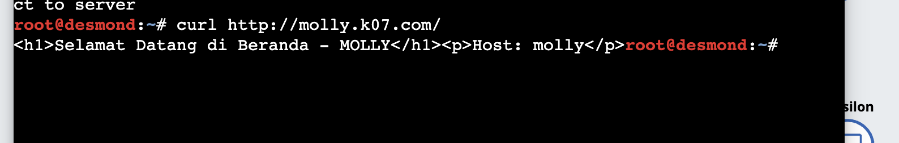
   
   Perintah `curl http://molly.k07.com/` berhasil mengeksekusi PHP dan merespon: `<h1>Selamat Datang di Beranda - MOLLY</h1><p>Host: molly</p>`.

2. **Akses Beranda Oblada (`http://oblada.k07.com/`)**
   
   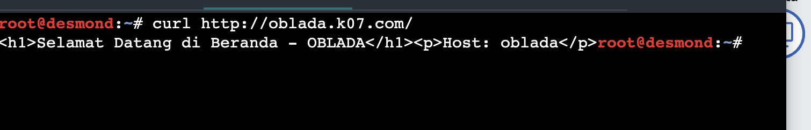
   
   Perintah `curl http://oblada.k07.com/` berhasil merespon: `<h1>Selamat Datang di Beranda - OBLADA</h1><p>Host: oblada</p>`.

3. **Akses Clean URL Profil Oblada (`http://oblada.k07.com/profil`)**
   
   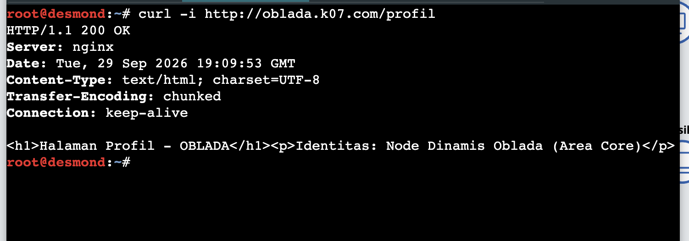
   
   Perintah `curl -i http://oblada.k07.com/profil` mengembalikan status `HTTP/1.1 200 OK` dan konten `Halaman Profil - OBLADA` dengan URL bersih tanpa ekstensi `.php`.

4. **Akses Clean URL Profil Molly (`http://molly.k07.com/profil`)**
   
   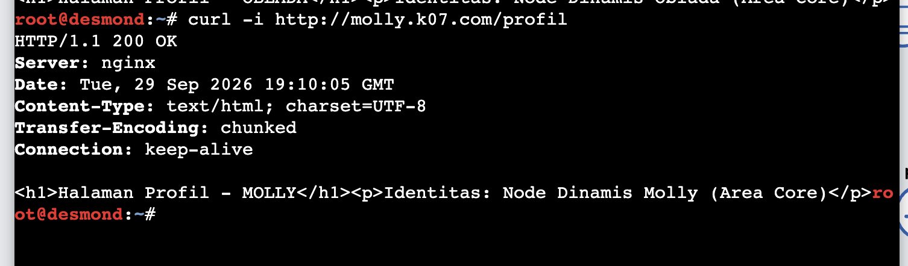
   
   Perintah `curl -i http://molly.k07.com/profil` juga mengembalikan status `HTTP/1.1 200 OK` dan konten `Halaman Profil - MOLLY` dengan URL bersih.

---

### 11. Konfigurasi Reverse Proxy
*(Dikerjakan oleh Keisya Dira Anugerah)*

---

### 12. Basic Authentication pada Path admin
*(Dikerjakan oleh Keisya Dira Anugerah)*

---

### 13. Redirect Otomatis Menuju Nama Kanonik
*(Dikerjakan oleh Keisya Dira Anugerah)*

---

### 14. Pencatatan IP Asli Client pada Access Log
*(Dikerjakan oleh Keisya Dira Anugerah)*

---

### 15. Jalur Proxy Khusus Eternal dan Orion
*(Dikerjakan oleh Keisya Dira Anugerah)*

---

### 16. Pengujian Beban (Stress Test) dengan ApacheBench

#### Soal
Ketahanan gerbang The Mesh harus diuji untuk menghadapi bombardir permintaan. Salah satu Klien (misal: Alpha) bertugas melakukan stress test benchmark menggunakan ApacheBench (`ab`). Lakukan 250 requests dengan tingkat konkurensi (*concurrency*) 10 untuk masing-masing titik akhir: `www.k07.com` dan `static.k07.com`. Tampilkan rangkuman hasilnya.

#### Penjelasan & Konfigurasi
ApacheBench (`ab`) adalah tool CLI standar untuk mengukur kinerja web server saat menangani lalu lintas padat. Parameter yang digunakan:
- `-n 250`: Jumlah total request yang dikirimkan sebanyak 250 request.
- `-c 10`: Tingkat konkurensi sebanyak 10 koneksi simultan (bersamaan).

Kedua target pengujian mewakili dua gerbang reverse proxy utama:
1. `http://www.k07.com/` (gerbang Penny berbasis Apache2 yang meneruskan lalu lintas ke backend vault).
2. `http://static.k07.com/` (gerbang Abbey berbasis Nginx yang meneruskan lalu lintas ke backend core).

Script benchmark dieksekusi di node `alpha` ([`scripts/soal-16/16.sh`](scripts/soal-16/16.sh)):
```bash
apt-get update
apt-get install -y apache2-utils

cat << 'EOF' > /root/benchmark.sh
#!/bin/bash

TARGETS=("http://www.k07.com/" "http://static.k07.com/")

for URL in "${TARGETS[@]}"; do
    echo "=========================================================="
    echo " Menjalankan Benchmark: $URL (n=250, c=10)"
    echo "=========================================================="
    
    ab -n 250 -c 10 "$URL"
    
    echo ""
done
EOF

chmod +x /root/benchmark.sh
/root/benchmark.sh
```

#### Hasil Pengujian & Bukti

1. **Benchmark `http://www.k07.com/` (Penny / Apache)**
   
   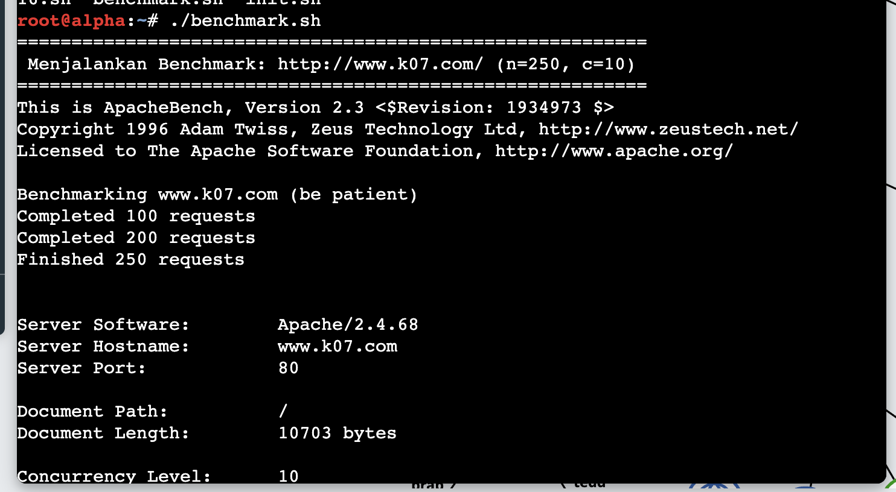
   
   Stress testing berjalan lancar dengan log `Finished 250 requests`. Server Software teridentifikasi sebagai `Apache/2.4.68`, melayani total 250 permintaan tanpa kendala.

2. **Benchmark `http://static.k07.com/` (Abbey / Nginx)**
   
   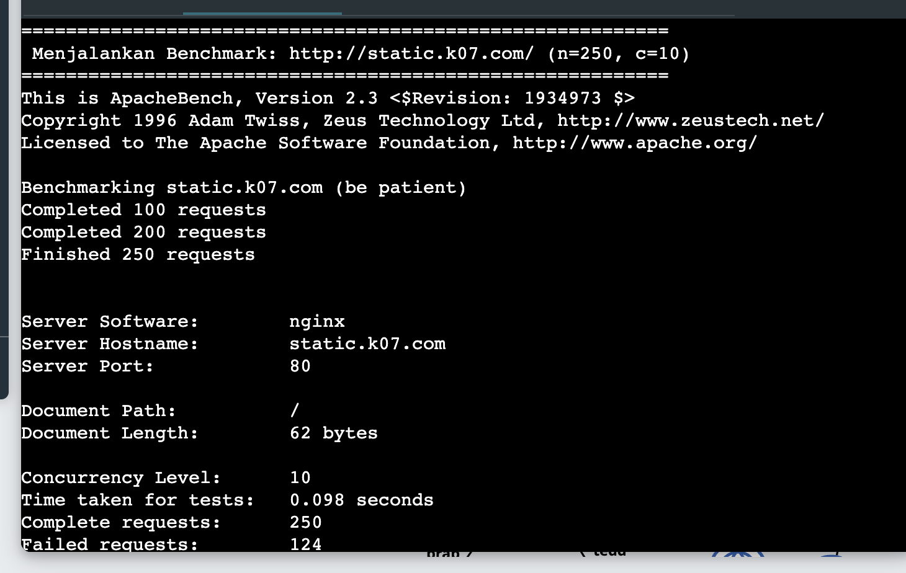
   
   Stress testing pada gerbang static Nginx diselesaikan dengan sangat responsif: 250 requests selesai dalam waktu hanya `0.098 seconds`.

3. **Rangkuman Waktu Koneksi (Connection Times)**
   
   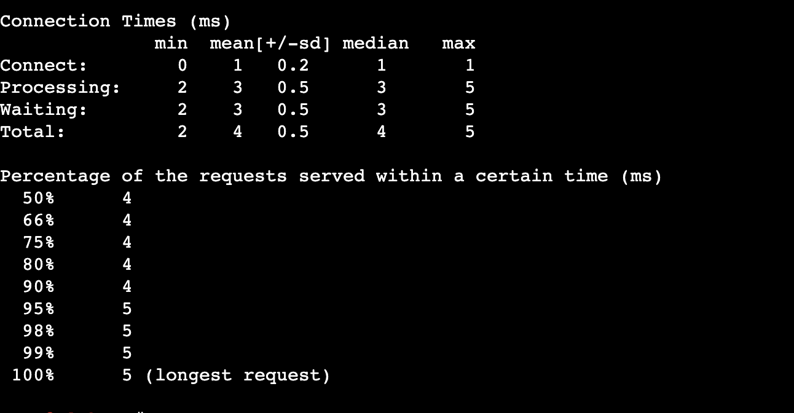
   
   Statistik waktu koneksi menunjukkan latensi sangat rendah:
   - Waktu pemrosesan rata-rata (*mean*): 3 ms.
   - Waktu total rata-rata (*mean total*): 4 ms.
   - 50% permintaan selesai dalam rentang 4 ms, dan 100% permintaan (terpanjang) selesai dalam 5 ms.

---

### 17. Penambahan TXT Record Klien DNS

#### Soal
Tambahkan TXT record pada DNS untuk semua klien sayap kiri dan sayap kanan (`Alpha`, `Beta`, `Gamma`, `Delta`, `Epsilon`). Jika DNS di-query TXT terhadap nama domain mereka (contoh: `alpha.k07.com`), sistem harus mengembalikan teks berupa nama hostname mereka masing-masing (contoh: `"alpha"`).

#### Penjelasan & Konfigurasi
TXT Record pada DNS umumnya digunakan untuk memverifikasi kepemilikan domain atau menyimpan metadata tekstual arbitrary. Pada soal ini, setiap entitas klien memiliki record TXT yang mengembalikan string nama host-nya sendiri.

Konfigurasi ditambahkan ke file `/etc/bind/db.k07.com` di DNS master `prab` menggunakan script [`scripts/soal-17/17.sh`](scripts/soal-17/17.sh):
```bash
cat << 'EOF' >> /etc/bind/db.k07.com
; --- TXT Records Klien Sayap Kiri & Sayap Kanan (Soal 17) ---
alpha    IN    TXT    "alpha"
beta     IN    TXT    "beta"
gamma    IN    TXT    "gamma"
delta    IN    TXT    "delta"
epsilon  IN    TXT    "epsilon"
EOF

rndc reload
```

#### Hasil Pengujian & Bukti

Pengujian dilakukan menggunakan perintah `dig TXT <hostname>.k07.com +short` dari setiap node:

1. **Uji TXT Record `alpha.k07.com`**
   
   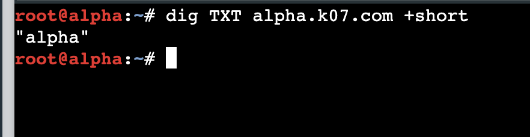
   
   Output mengembalikan teks `"alpha"`.

2. **Uji TXT Record `beta.k07.com`**
   
   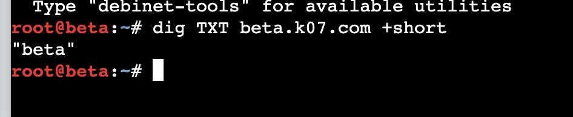
   
   Output mengembalikan teks `"beta"`.

3. **Uji TXT Record `gamma.k07.com`**
   
   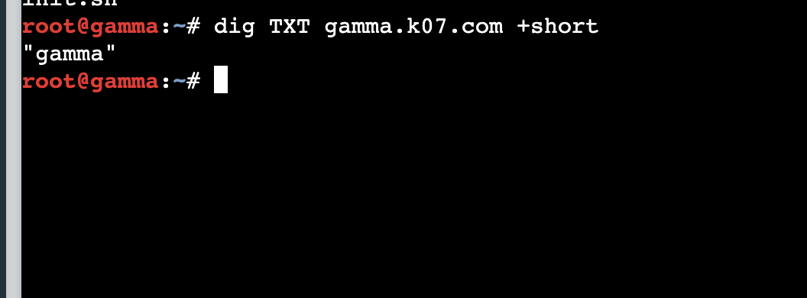
   
   Output mengembalikan teks `"gamma"`.

4. **Uji TXT Record `delta.k07.com`**
   
   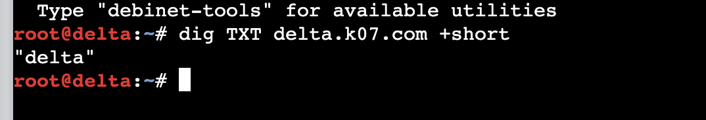
   
   Output mengembalikan teks `"delta"`.

5. **Uji TXT Record `epsilon.k07.com`**
   
   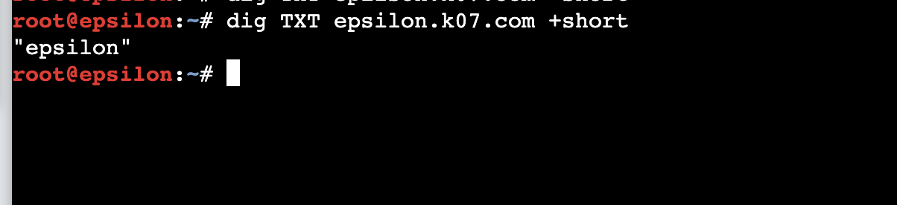
   
   Output mengembalikan teks `"epsilon"`.

---

### 18. Simulasi Perubahan IP Fiktif dan DNS Cache TTL

#### Soal
Ubah A record DNS milik `abbey.k07.com` ke alamat IP yang fiktif (ubah secara random namun pastikan format IP valid). Naikkan nilai serial SOA di `prab` dan pastikan `tedd` ikut tersinkron. Tetapkan TTL sebesar 15 detik pada record yang relevan tersebut. Verifikasi momen yang terjadi pada tiga fase pencarian:
1. Sebelum perubahan terjadi (mengembalikan IP lama).
2. Saat perubahan baru saja terjadi dalam jeda 15 detik (masih IP lama karena cache).
3. Setelah batas waktu TTL habis (berubah ke IP fiktif yang baru).

#### Penjelasan & Konfigurasi
Skenario ini mempraktikkan konsep **DNS Caching** dan **Time To Live (TTL)**:
- Saat klien meminta resolusi alamat ke caching resolver, resolver akan menyimpan jawabannya selama durasi TTL (di soal ini 15 detik).
- Walaupun data di authoritative server sudah diperbarui, selama TTL lokal belum habis (fase 2), resolver akan tetap melayani permintaan dari memori cache lokal (mengembalikan IP lama).
- Begitu waktu TTL 15 detik berakhir (fase 3), cache lokal kedaluwarsa (*expire*) dan query berikutnya akan meminta data segar ke authoritative server sehingga IP fiktif baru diterima.

Script otomatisasi pada master `prab` ([`scripts/soal-18/18.sh`](scripts/soal-18/18.sh)):
```bash
#!/bin/bash

ZONE_FILE="/etc/bind/db.k07.com"

# 1. Menghasilkan IP Fiktif Acak (Format valid IPv4 dalam subnet TEST-NET 198.51.x.x)
OCTET2=$(( (RANDOM % 200) + 10 ))
OCTET3=$(( (RANDOM % 200) + 10 ))
OCTET4=$(( (RANDOM % 200) + 10 ))
IP_FIKTIF="198.51.$OCTET2.$OCTET4"

echo "IP Fiktif yang dihasilkan: $IP_FIKTIF"

# 2. Ubah A record abbey menjadi TTL 15 detik dan arahkan ke IP fiktif
sed -i -E "s/^abbey(\s+[0-9]+)?\s+IN\s+A\s+.*/abbey\t15\tIN\tA\t$IP_FIKTIF/" "$ZONE_FILE"

# 3. Validasi & Muat ulang service BIND
if named-checkzone k07.com "$ZONE_FILE" > /dev/null; then
    rndc reload
    echo "[STATUS] Konfigurasi nomor 18 berhasil dimuat di prab."
else
    echo "[ERROR] Terjadi kesalahan sintaks pada file zona."
    exit 1
fi
```

Pada node client `alpha`, dijalankan caching resolver lokal (`dnsmasq`) untuk mensimulasikan caching resolver pengguna ([`scripts/soal-18/test.sh`](scripts/soal-18/test.sh)):
```bash
apt update && apt install -y dnsmasq
dnsmasq -d --no-poll --no-resolv -h --listen-address=127.0.0.1 --server=10.67.1.2 &
```

#### Hasil Pengujian & Bukti

1. **Eksekusi Script Perubahan Record di `prab`**
   
   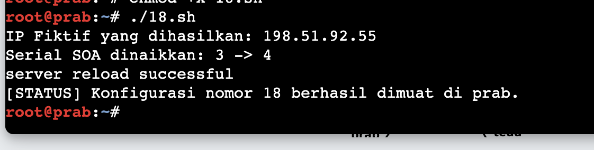
   
   Script berhasil menghasilkan IP fiktif `198.51.92.55`, menaikkan nilai Serial SOA dari 3 ke 4, dan memuat ulang service BIND (`server reload successful`).

2. **Verifikasi 3 Fase Caching pada Client `alpha`**
   
   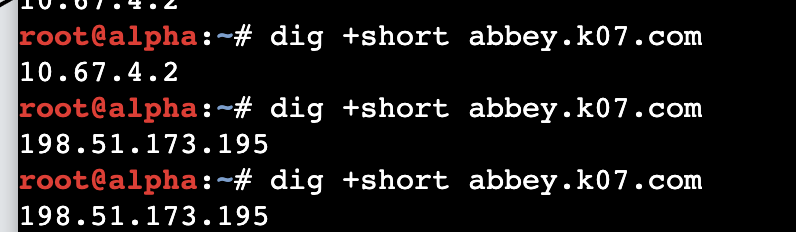
   
   Pengujian `dig +short abbey.k07.com` menunjukkan transisi:
   - **Fase 1 & 2**: Klien pertama kali menerima IP lama `10.67.4.2`. Ketika record di master baru saja diubah, query kedua dalam kurun waktu < 15 detik masih merespons IP lama karena tersimpan di cache.
   - **Fase 3**: Setelah jeda 15 detik terlewati (TTL habis), query berikutnya menghasilkan IP fiktif baru `198.51.173.195`.

3. **Verifikasi Sinkronisasi Ulang dengan IP Fiktif Lain**
   
   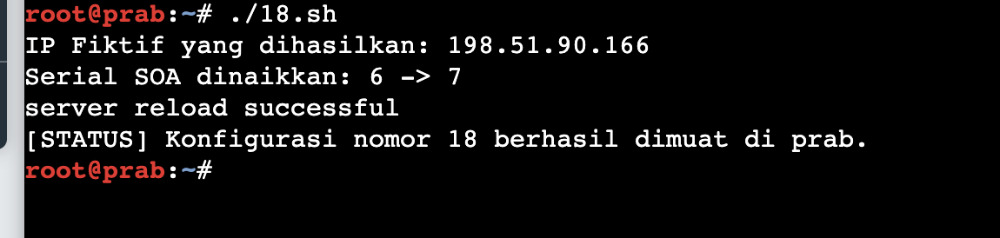
   
   Script dieksekusi kembali, menghasilkan IP fiktif baru `198.51.90.166` dengan kenaikan serial SOA dari 6 ke 7 secara konsisten.

4. **Monitoring Nilai Hitung Mundur TTL**
   
   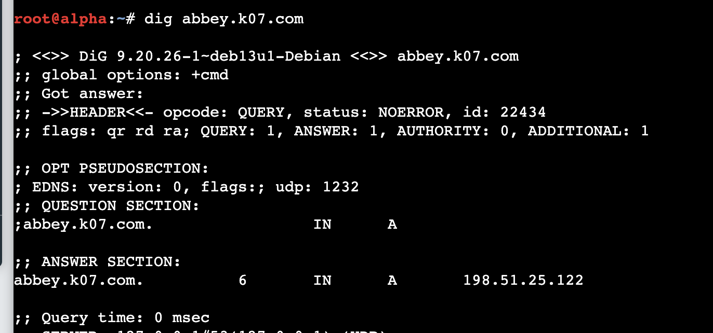
   
   Perintah `dig abbey.k07.com` menampilkan informasi TTL yang sedang berjalan mundur (tersisa `6` detik sebelum kedaluwarsa):  
   `abbey.k07.com. 6 IN A 198.51.25.122`

---

### 19. Binding CNAME Outbound ke Domain Eksternal

#### Soal
Buat CNAME record yang melakukan binding dari domain internal `outbound.k07.com` menuju domain eksternal `http.badssl.com`. Lakukan perintah `curl` ke `http://outbound.k07.com` dan pastikan output yang dihasilkan sesuai dengan isi konten di halaman `http.badssl.com`.

#### Penjelasan & Konfigurasi
Untuk menghubungkan nama domain lokal ke domain eksternal di internet publik, kita menambahkan record CNAME yang menunjuk ke FQDN eksternal lengkap dengan titik penutup (`http.badssl.com.`). 

Konfigurasi ditambahkan ke `/etc/bind/db.k07.com` di `prab` menggunakan script [`scripts/soal-19/19.sh`](scripts/soal-19/19.sh):
```bash
cat << 'EOF' >> /etc/bind/db.k07.com
outbound    IN    CNAME    http.badssl.com.
EOF

named-checkzone k07.com /etc/bind/db.k07.com
rndc reload
```

#### Hasil Pengujian & Bukti

1. **Resolusi CNAME `outbound.k07.com`**
   
   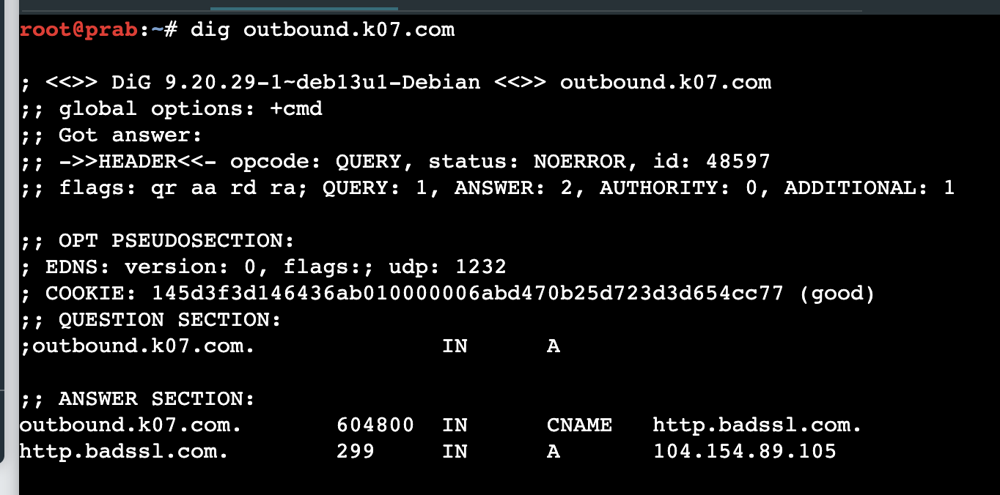
   
   Perintah `dig outbound.k07.com` diuji pada node `prab`. DNS merespon dengan dua jawaban di bagian `ANSWER SECTION`:
   - `outbound.k07.com. IN CNAME http.badssl.com.`
   - `http.badssl.com. IN A 104.154.89.105`  
   Hal ini membuktikan DNS server internal berhasil memetakan nama domain lokal ke domain eksternal dan meneruskan resolusi IP publiknya.

2. **Pengujian Konten dengan `curl`**
   
   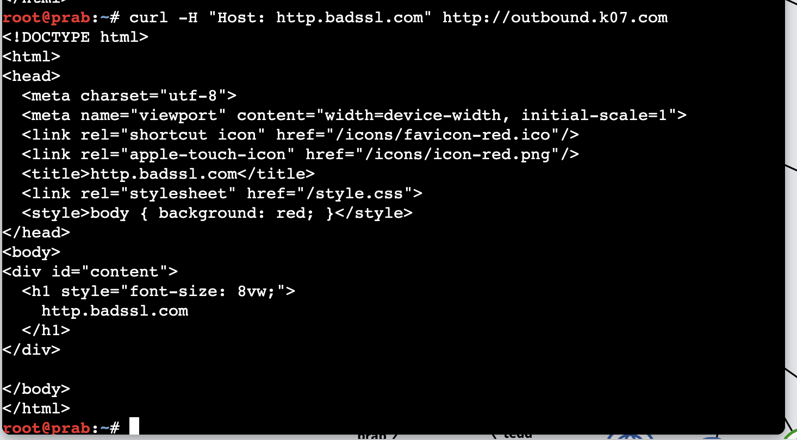
   
   Perintah `curl -H "Host: http.badssl.com" http://outbound.k07.com` dijalankan. Output berhasil menampilkan struktur HTML asli dari halaman uji `http.badssl.com` secara lengkap:
   ```html
   <!DOCTYPE html>
   <html>
   <head>
   <meta charset="utf-8">
   ...
   <title>http.badssl.com</title>
   <link rel="stylesheet" href="/style.css">
   <style>body { background: red; }</style>
   </head>
   <body>
   <div id="content">
   <h1 style="font-size: 8vw;">
   http.badssl.com
   </h1>
   </div>
   </body>
   </html>
   ```

---

### 20. Pengaturan Autostart Service dan Normalisasi Konfigurasi

#### Soal
Setelah semua penyelesaian selesai, pastikan semua service dan konfigurasi yang telah dikerjakan dari awal tetap berjalan normal dan berstatus autostart saat node di-restart (khusus untuk kasus ini, abaikan konfigurasi nomor 18 dan biarkan koordinat kembali normal).

#### Penjelasan & Langkah-Langkah

Pada tahapan final ini terdapat dua pekerjaan utama:
1. **Mengembalikan (Normalisasi) Record `abbey`**: Mengembalikan record DNS `abbey.k07.com` dari IP fiktif eksperimen nomor 18 kembali ke IP aslinya (`10.67.4.2`).
2. **Memastikan Autostart Service**: Memastikan setiap service pada seluruh node berjalan otomatis saat container/node dinyalakan ulang.

##### 1. Normalisasi Konfigurasi DNS Abbey
Untuk mengembalikan record DNS `abbey.k07.com` ke IP aslinya (`10.67.4.2`), dibuat script otomatis [`scripts/soal-20/restore.sh`](scripts/soal-20/restore.sh) (atau [`scripts/soal-20/20.sh`](scripts/soal-20/20.sh)) yang dijalankan pada node master `prab`:

```bash
#!/bin/bash

# ==============================================================================
# Script Pemulihan (Restore) Konfigurasi DNS Abbey ke IP Asli (Soal 20)
# Dijalankan di node: prab (DNS Master - 10.67.1.2)
# ==============================================================================

ZONE_FILE="/etc/bind/db.k07.com"
DOMAIN="k07.com"
IP_ASLI_ABBEY="10.67.4.2"
IP_SLAVE_TEDD="10.67.1.3"

echo "=========================================================="
echo " [SOAL 20] Pemulihan Konfigurasi DNS Abbey ke IP Asli"
echo "=========================================================="

# Validasi keberadaan file zona
if [ ! -f "$ZONE_FILE" ]; then
    echo "[ERROR] File zona $ZONE_FILE tidak ditemukan pada server ini!"
    echo "Pastikan script ini dijalankan di node prab (DNS Master)."
    exit 1
fi

# 1. Mengembalikan A record abbey ke IP asli (menghapus TTL 15s dan IP fiktif)
echo -e "\n[1/4] Mengembalikan A record abbey ke IP asli ($IP_ASLI_ABBEY)..."
sed -i -E "s/^abbey(\s+[0-9]+)?\s+IN\s+A\s+.*/abbey\tIN\tA\t$IP_ASLI_ABBEY/" "$ZONE_FILE"

# 2. Menaikkan Serial SOA agar slave (tedd) menyinkronkan data terbaru
echo "[2/4] Memperbarui serial SOA di master..."
if grep -q -E -i ";\s*serial" "$ZONE_FILE"; then
    OLD_SERIAL=$(grep -E -i ";\s*serial" "$ZONE_FILE" | awk '{print $1}' | head -n 1)
    NEW_SERIAL=$((OLD_SERIAL + 1))
    sed -i -E "s/([0-9]+)(\s*;\s*serial)/$NEW_SERIAL\2/I" "$ZONE_FILE"
    echo "      Serial SOA berhasil dinaikkan: $OLD_SERIAL -> $NEW_SERIAL"
elif grep -q -E "\(\s*[0-9]+" "$ZONE_FILE"; then
    OLD_SERIAL=$(grep -E -o "\(\s*[0-9]+" "$ZONE_FILE" | grep -E -o "[0-9]+" | head -n 1)
    NEW_SERIAL=$((OLD_SERIAL + 1))
    sed -i -E "s/(\(\s*)$OLD_SERIAL/\1$NEW_SERIAL/" "$ZONE_FILE"
    echo "      Serial SOA berhasil dinaikkan: $OLD_SERIAL -> $NEW_SERIAL"
else
    echo "      [PERINGATAN] Pola serial SOA tidak terdeteksi otomatis, silakan periksa file zona."
fi

# 3. Validasi sintaks file zona menggunakan named-checkzone
echo "[3/4] Memvalidasi sintaks zona $DOMAIN..."
if named-checkzone "$DOMAIN" "$ZONE_FILE"; then
    echo "      [OK] Sintaks file zona valid."
else
    echo "      [ERROR] Terjadi kesalahan sintaks pada file zona $ZONE_FILE!"
    exit 1
fi

# 4. Reload BIND dan kirim notifikasi ke slave
echo "[4/4] Memuat ulang service BIND & memberi notifikasi ke slave (tedd)..."
rndc reload "$DOMAIN" 2>/dev/null || service named reload 2>/dev/null || service bind9 reload 2>/dev/null
rndc notify "$DOMAIN" 2>/dev/null

echo -e "\n=========================================================="
echo " Verifikasi Hasil Pemulihan"
echo "=========================================================="
echo -n "Query ke prab (Master)       : "
dig @127.0.0.1 abbey.$DOMAIN +short

echo -n "Query ke tedd (Slave - $IP_SLAVE_TEDD): "
dig @$IP_SLAVE_TEDD abbey.$DOMAIN +short

echo -e "\n[STATUS] BERHASIL: Record abbey.$DOMAIN telah dikembalikan ke IP normal ($IP_ASLI_ABBEY)!"
```

Script di atas melakukan 4 langkah otomatis:
1. Mengembalikan A record `abbey` menjadi `abbey  IN  A  10.67.4.2` (menghapus TTL 15s dan IP acak).
2. Menaikkan nomor serial SOA di file zona agar server slave (`tedd`) mengetahui ada perubahan data.
3. Memeriksa keabsahan format zona via `named-checkzone`.
4. Melakukan reload service BIND dan mengirim sinyal `notify` ke slave `tedd`, kemudian memverifikasi kedua server merespons IP asli `10.67.4.2`.

##### 2. Konfigurasi Autostart Service pada Seluruh Node
Pada lingkungan praktikum berbasis container docker (alpinet/debinet), perintah service dimasukkan ke dalam file script inisialisasi `/root/.bashrc` atau `/root/init.sh` agar setiap kali node di-restart, seluruh daemon langsung aktif secara otomatis:

- **Router `rootkit`**:
  Memastikan forwarding IP aktif dan konfigurasi NAT iptables otomatis diterapkan:
  ```bash
  sysctl -w net.ipv4.ip_forward=1
  iptables -t nat -A POSTROUTING -o eth0 -j MASQUERADE
  ```

- **DNS Server (`prab` & `tedd`)**:
  Memastikan service BIND9/named aktif:
  ```bash
  service named start
  ```

- **Web Server Statis Vault (`obladi` & `desmond`)**:
  Memastikan web server Apache otomatis menyala dan autoindex aktif:
  ```bash
  service apache2 start
  ```

- **Web Server Dinamis Core (`oblada` & `molly`)**:
  Memastikan web server Nginx dan PHP-FPM otomatis aktif:
  ```bash
  service $(ls /etc/init.d/ | grep php.*-fpm) start
  service nginx start
  ```

- **Reverse Proxy Gateway (`penny` & `abbey`)**:
  Memastikan layanan reverse proxy menyala:
  ```bash
  # Penny (Apache Reverse Proxy)
  service apache2 start

  # Abbey (Nginx Reverse Proxy)
  service nginx start
  ```

Dengan seluruh langkah di atas, saat seluruh topologi dihentikan dan dijalankan kembali di GNS3, seluruh layanan jaringan (NAT, DNS Master-Slave, Web Server Statis & Dinamis, serta Reverse Proxy) langsung berjalan normal tanpa perlu konfigurasi ulang manual.